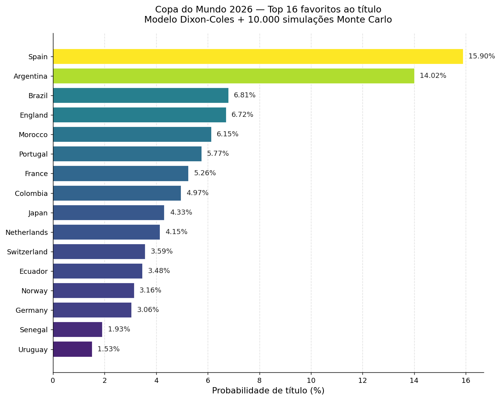

# Copa do Mundo 2026 — Forecast Probabilístico

[](https://www.python.org/)
[](LICENSE)



## A ideia

Falta pouco pra Copa começar e eu queria saber, com algum rigor, **quem
realmente tem chance de levantar a taça**. Não me bastava o "achismo" dos
canais esportivos, nem o ranking da FIFA que mistura amistoso com final de
Copa do Mundo no mesmo bolo.

Então montei o que daria pra montar: peguei o histórico de todas as partidas
de seleções desde 2022, ajustei um modelo estatístico que economista usa pra
prever futebol há quase 30 anos (Dixon-Coles), simulei a Copa **10 mil vezes**
e olhei a frequência com que cada seleção termina campeã.

Spoiler: Espanha e Argentina disparam, Marrocos aparece bem mais alto do que o
mercado de apostas precifica, e o modelo é cético com a França — que o
mercado adora.

## Como funciona

O pipeline é direto: **dado → modelo → simulação → resultado.**

**Dado.** 4.421 partidas internacionais entre 2022 e 2026, do dataset público
[`martj42/international_results`](https://github.com/martj42/international_results).
Filtrei o ciclo atual porque o que aconteceu na Copa de 2014 tem pouca relação
com a Holanda de 2026.

**Modelo.** Dixon-Coles (1997) é uma extensão do Poisson pra placares de
futebol. Estima por máxima verossimilhança um parâmetro de **ataque** e um de
**defesa** por seleção, mais um termo de **vantagem de mando** e uma correção
pra placares baixos (0-0, 1-0, 1-1 — que o Poisson puro subestima). Jogos mais
recentes pesam mais via decaimento exponencial (meia-vida de 1 ano).

**Simulação.** 10.000 Copas inteiras: fase de grupos com critério de
desempate, 8 melhores terceiros colocados, mata-mata com prorrogação e
pênaltis. Em cada partida, sorteio um placar a partir da distribuição que o
modelo prediz. A probabilidade de uma seleção ser campeã é a frequência com
que ela vence as 10 mil simulações.

**Validação.** Treinei só com dados até dezembro de 2025 e usei o modelo pra
prever as 165 partidas das eliminatórias de janeiro a maio de 2026, que eu já
sabia o resultado. Comparei contra três baselines (uniforme, Elo puro, e uma
versão bayesiana mais "esperta" que tentei). O Dixon-Coles MLE puro ganhou em
todas as métricas — Brier, log-loss e accuracy.

| Modelo                 | Brier ↓ | Log-loss ↓ | Accuracy ↑ |
|------------------------|--------:|-----------:|-----------:|
| Uniforme (chão)        | 0,667   | 1,099      | 43,6%      |
| Elo puro               | 0,657   | 1,152      | 49,1%      |
| **Dixon-Coles (MLE)**  | **0,533** | **0,895** | **55,8%**  |

> **Aprendizado honesto:** cheguei a montar uma versão "mais sofisticada" com
> prior bayesiano usando Elo + valor de mercado dos elencos. Pareceu uma boa
> ideia. O backtest mostrou que ficou **pior** — com 4 mil jogos de treino, o
> MLE já estava bem informado e o prior só introduziu viés. Voltei pra versão
> simples. Às vezes mais complexidade é só mais ruído.

## Os resultados

Top 8 favoritos (das 10k simulações):

| Seleção     | P(Título) | P(Final) | P(Avançar) |
|-------------|----------:|---------:|-----------:|
| Espanha     | 15,90%    | 15,9%    | 99,5%      |
| Argentina   | 14,02%    | 14,0%    | 97,8%      |
| Brasil      |  6,81%    |  6,8%    | 97,7%      |
| Inglaterra  |  6,72%    |  6,7%    | 97,2%      |
| Marrocos    |  6,15%    |  6,2%    | 94,8%      |
| Portugal    |  5,77%    |  5,8%    | 88,7%      |
| França      |  5,26%    |  5,3%    | 91,4%      |
| Colômbia    |  4,97%    |  5,0%    | 87,8%      |

Probabilidades das 48 seleções: [`results/world_cup_probabilities.csv`](results/world_cup_probabilities.csv).
Análise grupo a grupo: [`results/RELATORIO_FINAL.md`](results/RELATORIO_FINAL.md).

**Onde o modelo discorda do mercado:** comparei com odds da ESPN e Polymarket.
A maior divergência é a **França**: mercado dá 15,6%, modelo dá 5,3%. Eu
interpreto como prêmio de reputação (campeã 2018, vice 2022) que o mercado
cobra e o modelo não vê nos jogos recentes. Na outra ponta, **Argentina e
Marrocos** estão sendo subestimados pelo mercado — favoritos do modelo que
podem render aposta de valor pra quem gosta.

## Como rodar

```bash
git clone https://github.com/vini-haa/copa-2026-forecast
cd copa-2026-forecast
pip install -r requirements.txt

python -m src.collect.download_history   # baixa ~7MB de CSVs
python -m src.features.build_features    # prepara base de treino
python -m src.collect.build_fixtures     # extrai jogos da Copa
python -m src.main                       # ajusta + simula + reporta

# opcionais:
python -m src.model.backtest             # roda a validação out-of-sample
python -m src.model.calibration          # compara com odds das casas
streamlit run app.py                     # dashboard interativo (6 abas)
```

## Estrutura

```
copa-2026-forecast/
├── src/
│   ├── collect/       # ingestão dos dados
│   ├── features/      # base de treino (filtro temporal + pesos)
│   ├── model/         # Dixon-Coles, backtest, calibração
│   ├── simulate/      # Monte Carlo do bracket de 48 times
│   └── main.py        # orquestrador
├── app.py             # dashboard Streamlit
├── data/              # dados brutos e processados
├── results/           # probabilidades, ratings, gráfico, relatório
└── requirements.txt
```

## O que ficou de fora

Por honestidade, o que **não** está no modelo:

- **Lesões e escalações finais.** As listas de 23 só saem no dia 2 de junho.
  Quando saírem, dá pra ajustar manualmente, mas hoje o modelo trata a
  seleção como "o time médio que ela vem colocando em campo".
- **Momentum / efeito psicológico.** Cada partida é tratada como independente.
  Time que vem de goleada não ganha bônus, time que tomou virada no fim não
  perde nada. Simplificação aceitável, mas é simplificação.
- **Bracket oficial do mata-mata.** A FIFA ainda não confirmou os cruzamentos
  do formato de 48 times. Usei um cruzamento simétrico padrão; quando saírem
  os oficiais, é editar uma constante e re-rodar.
- **Fadiga de viagem.** O torneio tem 3 países anfitriões e voos de até 5h
  entre sedes. O modelo ignora isso.

## Stack

Python 3.11 · NumPy · Pandas · SciPy · Matplotlib · Streamlit · Plotly.

A modelagem é simples de propósito: queria que o código fosse legível e o
modelo, defensável. Quem quiser ir mais fundo, os hooks pra evoluir estão
todos em `src/model/`.

## Referências

- Dixon, M. J., & Coles, S. G. (1997). *Modelling Association Football Scores
  and Inefficiencies in the Football Betting Market*. JRSS C, 46(2), 265–280.
- Dataset: [martj42/international_results](https://github.com/martj42/international_results) (CC0)
- Elo: [eloratings.net](https://www.eloratings.net/)

## Autor

**Vinicius Henrique Albino Andrade**
[LinkedIn](https://www.linkedin.com/in/vini-haa/) · [GitHub](https://github.com/vini-haa)

Se você é recrutador, dev curioso ou só fã de futebol que gostou da análise,
me chama.
